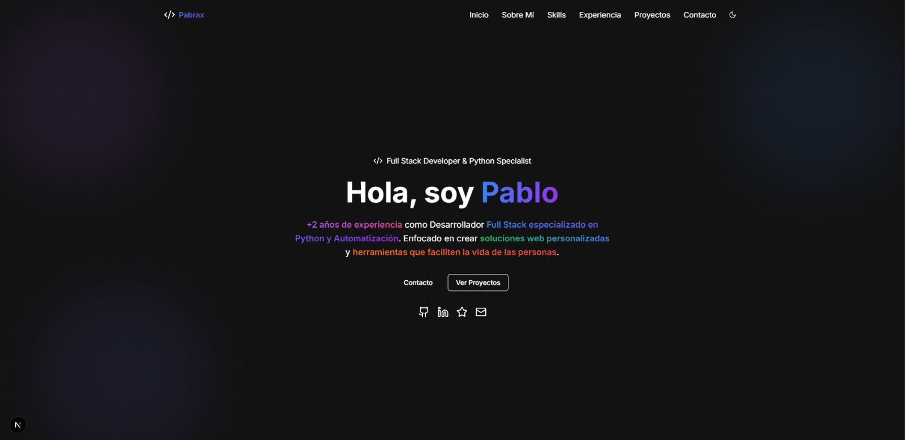

# Portafolio de Desarrollador

Un portafolio moderno, rápido y totalmente adaptable, creado con **Next.js 15**, **React 18** y **Tailwind CSS**.
Diseñado para mostrar proyectos, habilidades y trayectoria de forma limpia y profesional.




## ✨ Características principales

* Interfaz moderna y totalmente responsiva
* Modo oscuro y claro con cambio dinámico
* Animaciones suaves y transiciones elegantes
* Carga rápida y rendimiento optimizado con Next.js
* Componentes reutilizables y fáciles de mantener
* Construido con **TypeScript** para mayor fiabilidad


## ⚙️ Tecnologías

* **Framework:** Next.js 15 (App Router)
* **Frontend:** React 18 + TypeScript
* **Estilos:** Tailwind CSS
* **UI Components:** Radix UI
* **Iconos:** Lucide React
* **Temas:** next-themes
* **Animaciones:** Tailwind + CSS personalizado


## 🚀 Cómo usarlo:

```bash
# Clonar el proyecto
git clone <tu-repositorio>

# Instalar dependencias
npm install

# Ejecutar en modo desarrollo
npm run dev

# Compilar para producción
npm run build

# Iniciar en producción
npm start
```

---

## 🧩 Estructura del proyecto

```
portafolio/
├── app/
│   ├── components/          # Componentes principales
│   │   ├── ui/             # Elementos de interfaz base
│   │   ├── theme-toggle.tsx # Switch de tema claro/oscuro
│   │   └── ...             # Secciones del portafolio
│   ├── globals.css         # Estilos globales
│   ├── layout.tsx          # Layout general
│   ├── page.tsx            # Página principal
│   └── providers.tsx       # Configuración global (tema, etc.)
├── public/                 # Archivos estáticos
├── next.config.js          # Configuración de Next.js
├── tailwind.config.js      # Configuración de Tailwind
└── tsconfig.json           # Configuración de TypeScript
```


## 🧠 Personalización

Este portafolio está hecho para que lo adaptes fácilmente a tu estilo:

1. **Contenido:** Edita los componentes dentro de `app/components/`
2. **Estilos:** Ajusta los colores o fuentes en `app/globals.css` y `tailwind.config.js`
3. **Tema:** Modifica las variables de tema según tu paleta
4. **Componentes:** Agrega nuevas secciones o elementos reutilizables


## Diseño Responsivo

El diseño se adapta automáticamente a cualquier pantalla:

* 📱 **Móvil:** desde 320px
* 💻 **Tablet:** desde 768px
* 🖥️ **Escritorio:** desde 1024px
* 🧭 **Pantallas grandes:** desde 1280px


## 💡 Nota final

Este portafolio refleja mi enfoque como desarrollador: crear soluciones bien estructuradas, visualmente limpias y con tecnologías modernas. Más que una vitrina, es un punto de partida para seguir mejorando y explorando nuevas ideas.